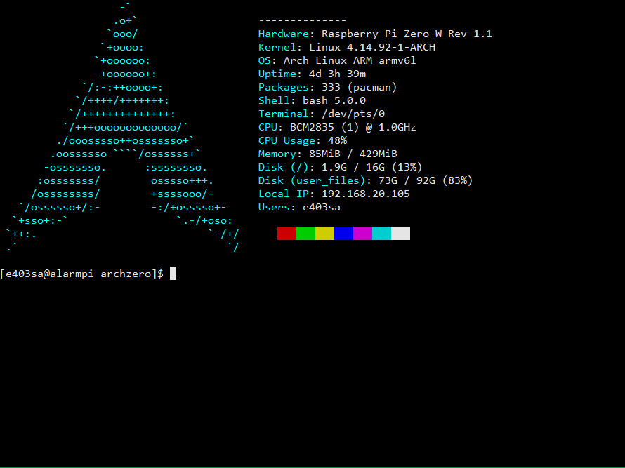

# archzero | ArchLinuxARM
### Basic NAS built on Raspberry Pi Zero W
Configuration files for NAS running ArchLinux ARM Raspberry Pi Zero W  
Listed files are configurations added on top of default installation.

